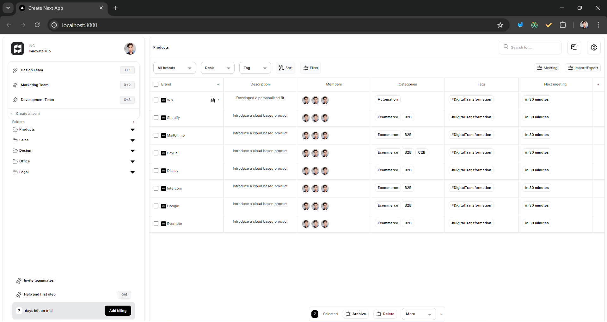

# Admin Dashboard

This project is an Admin Dashboard created using [Next.js](https://nextjs.org/), [Tailwind CSS](https://tailwindcss.com/), and JavaScript.

## Features

- **Teams and Folders Management**: Manage teams and folders with ease.
- **Products List**: Display a list of products with details like description, members, categories, tags, and next meeting time.
- **Sorting and Filtering**: Sort and filter products based on different criteria.
- **User Management**: Invite teammates and manage user permissions.
- **Responsive Design**: Fully responsive design for all screen sizes.

## Technologies Used

- [Next.js](https://nextjs.org/): A React framework for building server-side rendering and static web applications.
- [Tailwind CSS](https://tailwindcss.com/): A utility-first CSS framework for rapid UI development.
- JavaScript: The programming language used for frontend functionality.

## Getting Started

### Prerequisites

- [Node.js](https://nodejs.org/) (version 12 or later)
- [npm](https://www.npmjs.com/) or [Yarn](https://yarnpkg.com/)

### Installation

1. **Clone the repository:**

   \`\`\`bash
   git clone https://github.com/your-repo/admin-dashboard.git
   cd admin-dashboard
   \`\`\`

2. **Install the dependencies:**

   \`\`\`bash
   npm install
   # or
   yarn install
   \`\`\`

3. **Run the development server:**

   \`\`\`bash
   npm run dev
   # or
   yarn dev
   \`\`\`

   Open [http://localhost:3000](http://localhost:3000) with your browser to see the result.

## Project Structure

- `pages/`: Contains the Next.js pages.
- `components/`: Contains the React components used in the application.
- `styles/`: Contains the global styles and Tailwind CSS configuration.

## Customization

### Tailwind CSS

Tailwind CSS is configured in the `tailwind.config.js` file. You can customize the theme, extend the styles, and add new utilities as needed.

### Next.js

Next.js configuration can be found in the `next.config.js` file. You can modify the settings based on your project requirements.

## Deployment

To deploy the project, you can use platforms like [Vercel](https://vercel.com/), [Netlify](https://www.netlify.com/), or any other hosting service that supports Next.js.

### Example with Vercel

1. **Install Vercel CLI:**

   \`\`\`bash
   npm install -g vercel
   \`\`\`

2. **Deploy:**

   \`\`\`bash
   vercel
   \`\`\`

   Follow the prompts to deploy your project.

## Contributing

Contributions are welcome! Please fork the repository and create a pull request with your changes.

## License

This project is licensed under the MIT License.
